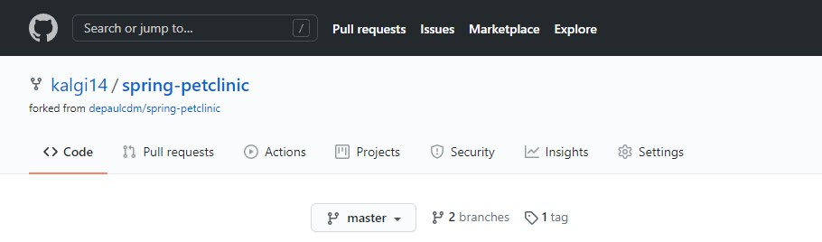
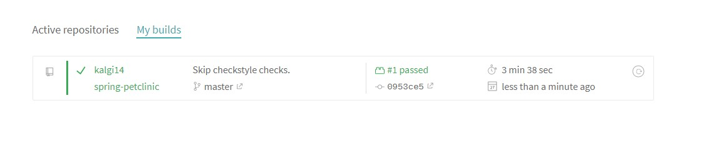
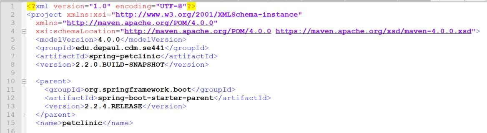
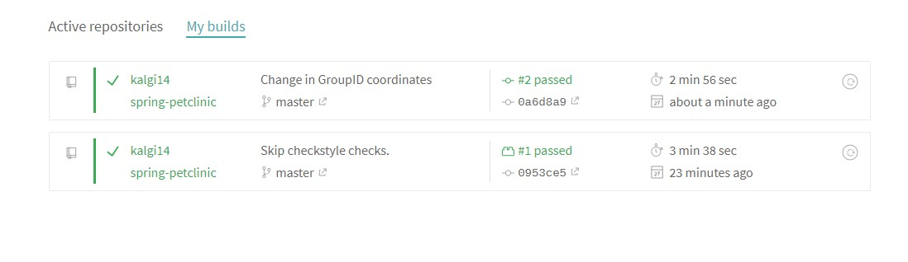
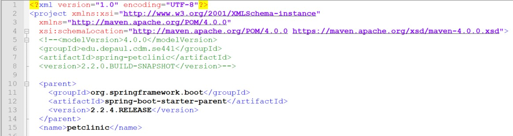
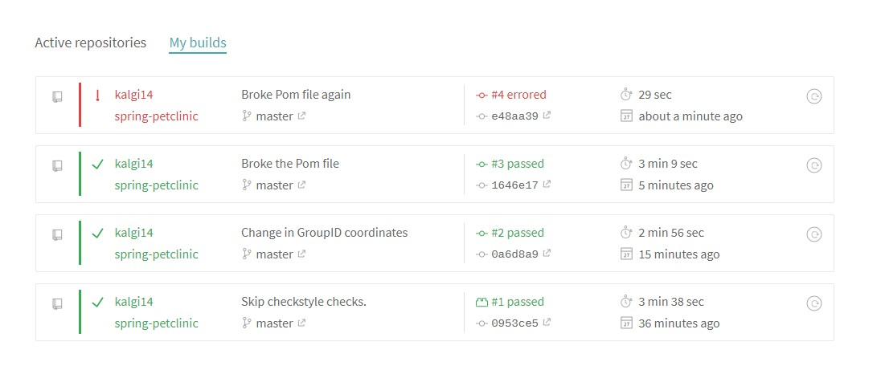
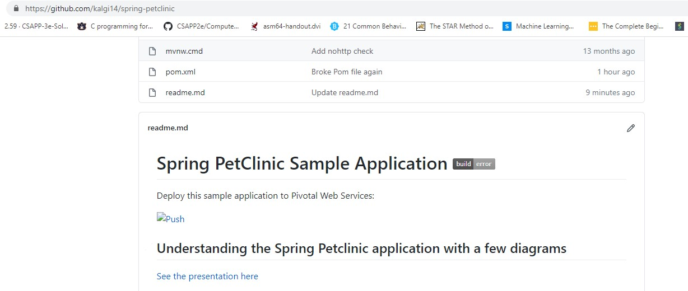
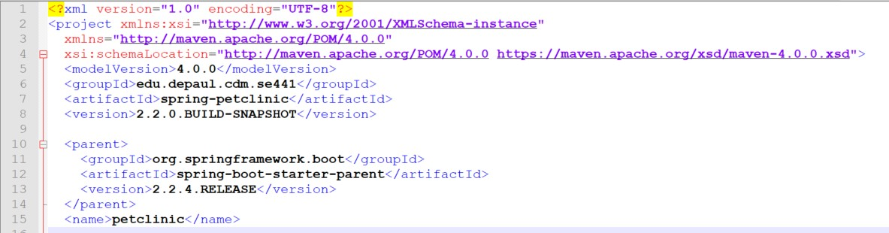
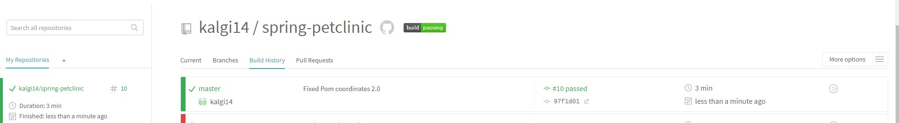
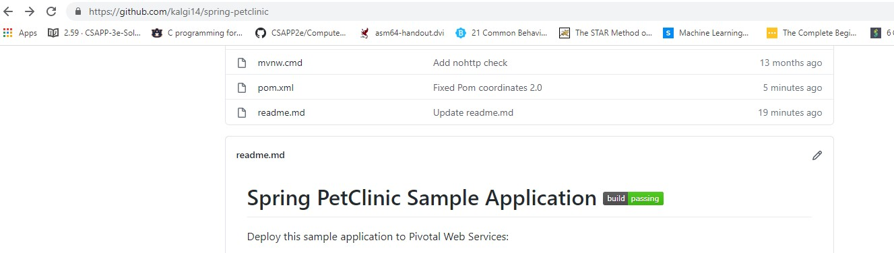

KALGI PAWAR- 1949662

- [5 pts] My Github account showing that is has been forked from the depaulcdm/springpetclinic repository.

- [5 pts] Travis CI dashboard showing a successful first build.

- [5 pts] The section of the POM file showing the coordinates after changing them.

- [5 pts] Travis CI dashboard showing a successful build after changing of the group ID.

- [5 pts] The section of the POM file showing the coordinates after commenting them out.

- [5 pts] Travis CI dashboard showing the unsuccessful build after the breaking change.

- [5 pts] Github repository with the readme.md file selected showing the build failed status after the Travis CI build fails.

- [5 pts] The section of the POM file showing the coordinates after fixing them.

- [5 pts] Travis CI dashboard showing the successful build after the breaking change has been fixed.

- [5 pts]  Github repository with the readme.md file selected showing the build success status after the Travis CI build has recovered.

